# WdPAI

Repozytorium zawierające projekt z przedmiotu Wstęp do Projektowania Aplikacji Internetowych  
Aplikacja do tworzenia notatek

## Table of contents
* [General info](#general-info)
* [Technologies](#technologies)
* [Screenshots](#screenshots)
* [Usage](#usage)

## General info
- Register and log into the app
- Add and remove notes
- Change user settings

## Technologies
- HTML5
- CSS3
- PHP 7.4
- DOCKER
- POSTGRES

## Screenshots
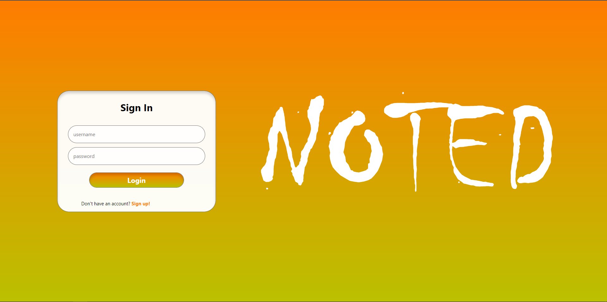
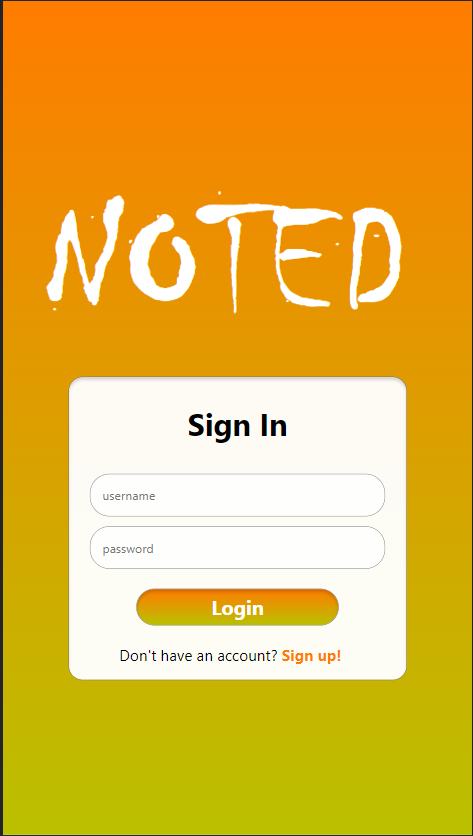
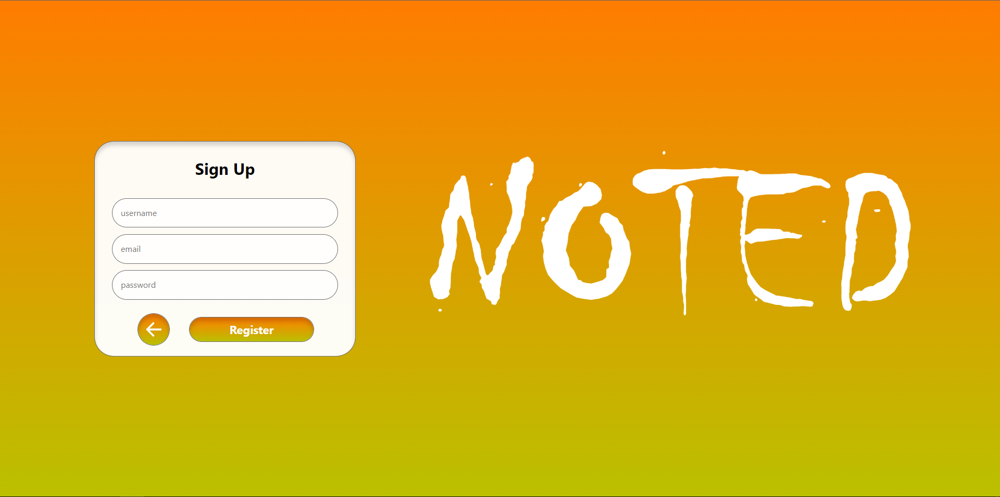
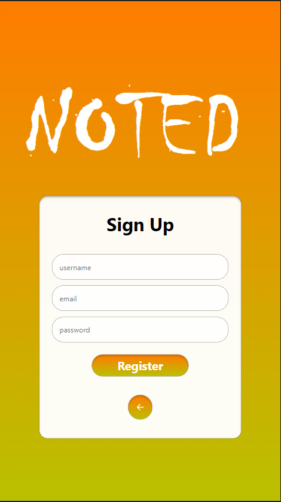
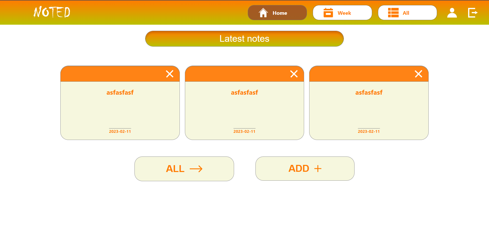
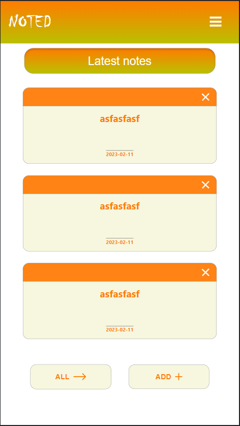
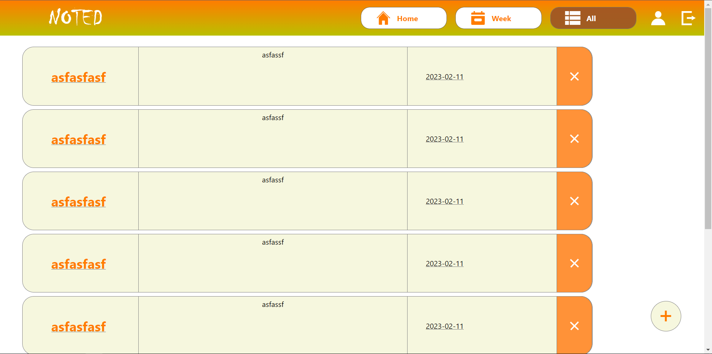
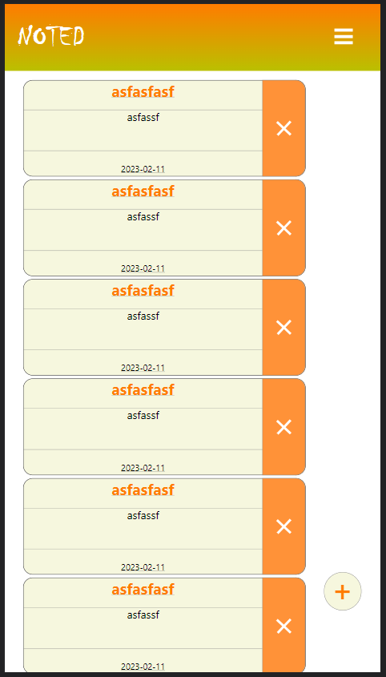
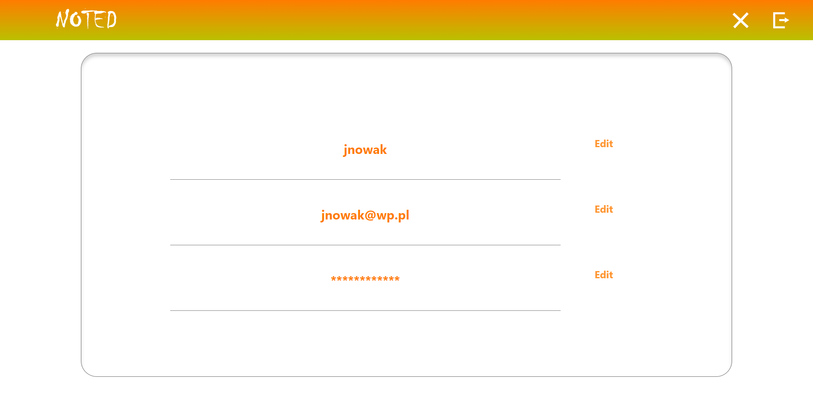
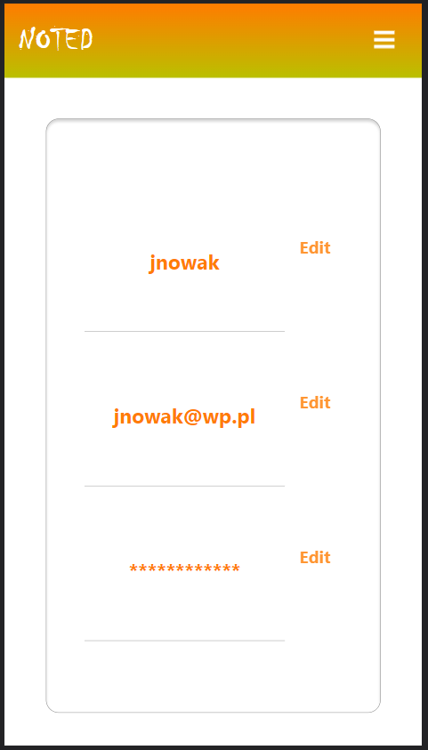
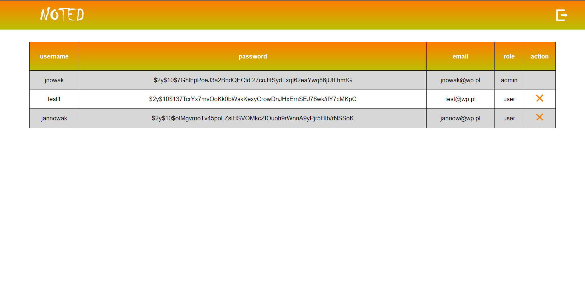
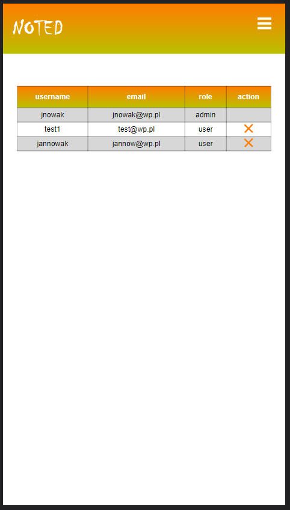

## Usage
- To start app type: ```docker-compose up```
